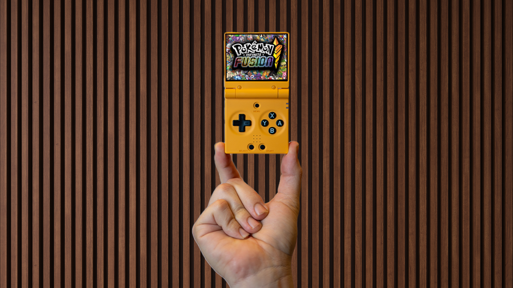
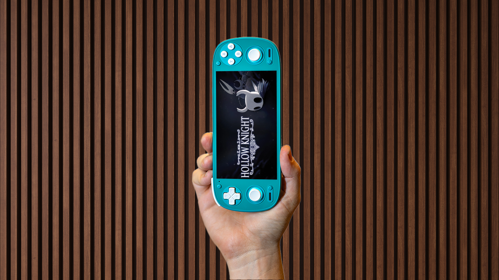
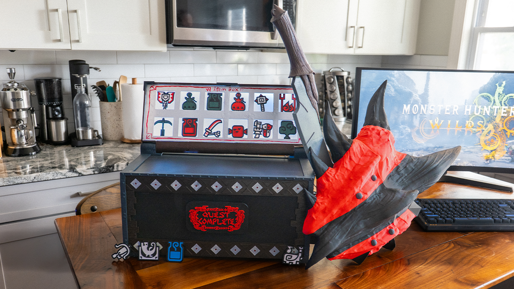

<html lang="en">
<head>
  <meta charset="UTF-8" />
  <meta name="viewport" content="width=device-width, initial-scale=1.0" />
  <title>Links | Links</title>
  
</head>
<body>
  <main class="screen">
    <section class="left">
      
+

      
+

      
+

      

      

      

      

      

        <h1 class="logo">Davey G.
        Link terminal</h1>
      

      

        
Press  to continue

        
|||||||||| × ⌬ 2893 ▬

        
Esc Exit to desktop

      

      

        

          <a class="link-btn" href="https://youtube.com" target="_blank" rel="noopener noreferrer">
            01 YouTube
            ↗
          </a>
          <a class="link-btn" href="https://tiktok.com" target="_blank" rel="noopener noreferrer">
            02 TikTok
            ↗
          </a>
          <a class="link-btn" href="https://instagram.com" target="_blank" rel="noopener noreferrer">
            03 Instagram
            ↗
          </a>
          <a class="link-btn" href="#" target="_blank" rel="noopener noreferrer">
            04 Hardware Ranked
            ↗
          </a>
        

      

    </section>

    <section class="right">
      

        Drop in jpg or webp files instead of video. 
        Replace frame-1.jpg to frame-4.jpg.
      

      

        
      

      

        

        

        

        <!-- Replace these with your own compressed stills. Using 4 webp images usually stays far below 25 MB total. -->
        

        

        

        

        

          
          
          
        

        

      

      
+

    </section>
  </main>
</body>
</html>
